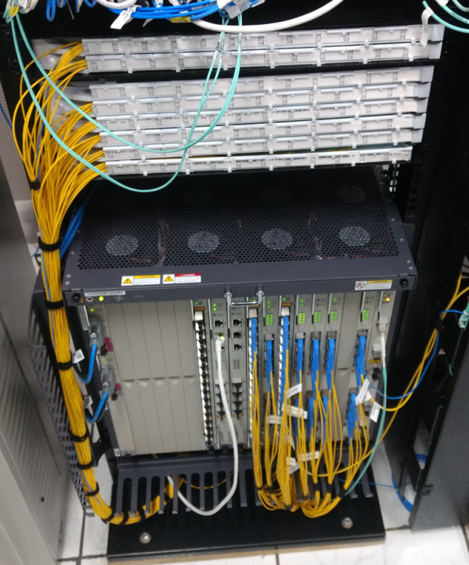

# Desafio VirteX

### Cenário Geral – O que é uma Rede GPON?

A rede GPON é uma rede óptica passiva (Passive Optical Network – PON). Ela permite a
adesão de uma rede multiponto, garantido a possibilidade de uma geração de rede Fiber
to the Home (FTTH, ou “Fibra para casa”) e Fiber to the Building (FTTB, ou “Fibra para o
prédio”). Os equipamentos utilizados não usam energia elétrica para seu funcionamento,
de forma que trazem economia.
Redes passivas são aquelas nas quais não há elementos energizados entre a Optical Line
Terminal (OLT) e a Optical Network Unit (ONU), baseada em óptica e transmissão de luz.

Para uma rede GPON, é necessário existir uma OLT (que é o equipamento que transmite
luz para os dispositivos na ponta da rede (as ONUs). Cada porta desse equipamento, no
caso das redes GPON, podem ser atendidos 128 clientes. Na imagem abaixo, um exemplo
de OLT (uma que está em produção na nossa rede), e cada fio que sai do equipamento, é o
que suporta os 128 clientes, e chamamos de ramal.



Essa OLT descrita na imagem acima, é apenas um modelo de OLT. Sendo que existe
diversas fabricantes, cada uma com uma CLI própria, e saídas próprias de comandos. E
será nisso que irá consistir o nosso desafio.

---

### Etapa 01 – Leitura dos arquivos

Para que possamos ter um cenário um pouco real, acabamos pegando a saída do
comando nas OLTs que nos listam as informações as ONUs autorizadas, e qual está online
ou off-line no momento. O modo de identificação da ONU, além de ser o endereço slot
(card)/port (porta do carde)/ont_id (identificador a ONU no endereço), também temos o SN
do dispositivo (que é uma chave única que também utilizamos para documentar no
sistema, pois isso representa um equipamento único dentro do universo de ONUs).

Na pasta de Inputs, possuímos 3 arquivos txt.

- OntInfo – Huawei: saída do comando, onde em um único comando, é possível
  pegar: slot, port, ont_id, sn e status (online e off-line).
- “OntInfo – ZTE – SNs” e “OntInfo – ZTE – SNs – State”: saída de dois comandos, onde
  em um eu possuo a informação de slot, port, ont_id e sn. E no outro comando,
  possuo a saída de slot, port, ont_id e status (online e off-line).
  Sendo assim, o objetivo desta etapa, é criar um parse para cada informação, onde
  possuímos as informações padronizadas de: slot, port, ont_id, sn e state.

---

### Etapa 02 – Banco de Dados

Com os parsers da etapa 01, vamos precisar guardar as informações obtidas no banco de
dados. Além das informações de slot, port, ont_id, sn e state. Vamos precisar puxar no
FrontEnd algo que diferencie de qual OLT é tal sn, se veio da Huawei ou da ZTE.
Nessa etapa, recomendamos utilizar uma imagem Docker, para que na hora de
executarmos o projeto internamente, possamos conseguir subir o banco de dados sem
dificuldades.

---

### Etapa 03 – Web Server/BackEnd

Com o banco de dados criados, e os parsers dos comandos tudo ok, agora é hora de criar
um Web Server no qual possuímos duas rotas:

1. Ler os arquivos (estaticamente mesmo) e realizar o registro no banco de dados.
2. Obter os dados gravados no banco.

---

### Etapa 04 – FrontEnd

Com todas as etapas anteriores “no jeito”, agora, só precisamos mostrar os dados em tela,
e ter um botão para que possamos fazer a inserção dos dados estáticos no banco de
dados, e tal comando ter sido feito pelo o usuário.

---

### Etapa 05 – Documentação

Para a entrega do projeto, preferimos que ele seja entregue em um repositório público do
Git, no qual, possua um README.md descrevendo o passo a passo para que possamos
executar o projeto na nossa máquina local, além de descrever as dependências
necessárias para a execução do projeto.

---

### Dependências necessárias para a execução do projeto

Para executar essa aplicação tenha instalado na sua máquina:

- Node
- Docker
- Docker Compose

---

### Como baixar o projeto

Faça o download do repositório para a sua máquina usando o comando abaixo

```bash
git clone https://github.com/samucka98/DesafioVirteX.git
```

### Instalação de dependencias

Dentro do diretório **server** digite o comando abaixo

```bash
npm install
```

Dentro do diretório **client** digite o comando abaixo

```bash
npm install
```

---

### Subindo o banco de dados

Dentro do diretório **desafiovirtex** digite o comando abaixo

```bash
docker-compose up -d
```

---

### Executando o WebServer

Dentro do diretório **server** digite o comando abaixo

```bash
npm run dev
```

---

### Executando o Front-end

Dentro do diretório **client** digite o comando abaixo

```bash
npm run dev
```

Você terá a aplicação rodando na porta 3000 e poderá acessar abrindo um navegador e digitando a url

```bash
http://localhost:3000
```

---

### Endpoints

| Method | Recurso      | Descrição                                                                                                 |
| ------ | ------------ | --------------------------------------------------------------------------------------------------------- |
| _GET_  | `/load-data` | Lê os arquivos dentro do diretório **server/inputs** estaticamente e realiza o registro no banco de dados |
| _GET_  | `/get-data`  | Recupera os dados registrados no banco                                                                    |
